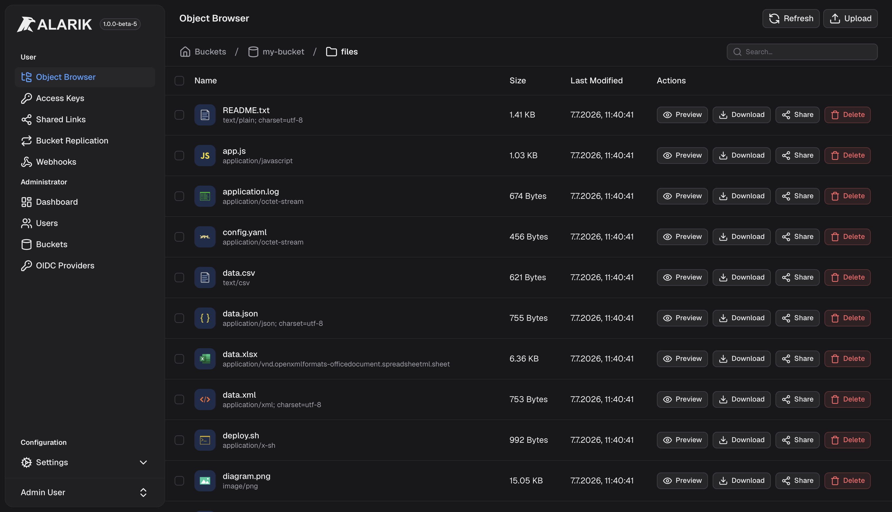

  

  

  
  
  

  

  

# Alarik - a High-Performance S3-Compatible Object Storage

Alarik is a high-performance, S3-compatible object storage system written in **Swift**, licensed under the **Apache 2.0** license. It aims to deliver exceptional speed, developer-friendly ergonomics, and a modern cloud-native core. See [Documentation](https://alarik.io/docs)

## Why Alarik?

Recent shifts in the ecosystem-especially surrounding MinIO-have revealed how fragile it is to depend on a single “reference” implementation for S3-compatible storage. These changes highlighted structural, licensing, and philosophical issues that many teams had long overlooked.

**Alarik exists to provide a modern, transparent, community-driven alternative.**
Developers and organizations need an S3-compatible store that is fast, simple to operate, easy to extend, and genuinely open-source. No licensing traps, no moving goalposts.

The goal: a self-hosted, high-speed S3 system built for today’s workloads, without the enterprise upsell.

## Features

### S3-Compatible API

| Feature | Notes |
| --- | --- |
| Core object operations | Put, Get, Head, Delete, Copy, multi-object delete |
| Multipart uploads | Create, upload part, complete, abort, list parts/uploads |
| Bucket versioning | Enabled/suspended, version listing, delete markers |
| Conditional requests | `If-Match`, `If-None-Match`, `If-Modified-Since`, `If-Unmodified-Since` |
| Range reads | Including suffix ranges, correct `416` semantics |
| Presigned URLs | Query-string (SigV4) auth, up to 7-day expiry |
| Object tagging | Bucket and object-level tag-sets |
| Bucket policies | JSON policy documents, public access block |
| Lifecycle rules | Expiration, noncurrent version expiration, incomplete multipart cleanup |
| Bucket webhooks | AWS-event-shaped notifications over HTTP (see below) |
| Bucket replication | Continuous, SigV4-signed replication to remote S3-compatible targets (see below) |
| SigV4 authentication | Header and query auth, chunked (streaming) payloads |

### Web Console

| Feature | Notes |
| --- | --- |
| Object browser | Upload, download, delete, folder navigation |
| Drag-and-drop upload | Files and whole folders, with progress tracking |
| Recursive search | Find objects by name across nested folders |
| Bucket & folder stats | On-demand size and object count |
| Metadata editing | Content-Type and custom metadata, in place, without re-uploading |
| Object versioning UI | Browse, preview, download, and delete individual versions |
| Shared links | Time-limited, unauthenticated public links to an object |
| Admin dashboard | Live CPU/RAM/traffic charts, storage stats, user & bucket management |

### Authentication & Access Control

| Feature | Notes |
| --- | --- |
| Local accounts | Username/password, optional open self-registration |
| OIDC SSO | Admin-managed, multiple simultaneous identity providers, optional auto-provisioning |
| S3 access keys | Per-user, with optional expiration |
| Bucket policies | Fine-grained, S3-compatible JSON policies |
| Public access block | Bucket-level override to block public access regardless of policy |

### Webhooks (Event Notifications)

| Feature | Notes |
| --- | --- |
| AWS-compatible payloads | Same event structure (v2.4) as S3 Event Notifications |
| HMAC-signed deliveries | Verify authenticity with a per-rule shared secret |
| Reliable delivery | Persistent outbox, survives restarts, exponential backoff retries |
| Delivery health | Inspect pending/failed deliveries and retry on demand, from the console or API |
| Event & key filtering | Subscribe by event type, key prefix, and/or suffix |

### Bucket Replication

| Feature | Notes |
| --- | --- |
| Real S3 protocol | SigV4-signed `PutObject`/multipart/`DeleteObject` requests, works against any S3-compatible target |
| Target + rule model | Reusable remote targets (endpoint, credentials), referenced by prefix-filtered rules |
| Reliable delivery | Persistent outbox, survives restarts, exponential backoff retries |
| Sync or async per rule | Async by default; a rule can opt into holding the client's write until delivery completes |
| Opt-in delete & existing-object replication | Deletes and pre-existing objects are never replicated unless a rule opts in |
| Resync | On-demand replication of a bucket's existing objects for a rule |
| Task health | Inspect pending/failed replication tasks and retry on demand, from the console or API |

### Horizontal Scaling

| Feature | Notes |
| --- | --- |
| Postgres-backed control plane | Opt-in multi-node HA for buckets, users, access keys, and policies behind a load balancer |
| Erasure-coded object data | Reed-Solomon `k` data + `m` parity shards across nodes (MinIO/Ceph-style), rebuildable from any `k` - the durability of replication at ~1.3-1.5x overhead instead of 3x |
| Coordination-free placement | Rendezvous (HRW) hashing places each object's shards deterministically, no range-sharding hotspots or coordinator |
| Any node serves any request | An entry node forwards to a responsible node transparently - no client-visible routing logic |
| Quorum writes | A write acks once a quorum of shards land durably, with async catch-up for stragglers |
| Read-repair & bit-rot scrubbing | Missing or silently-corrupted shards are rebuilt from survivors automatically - on read, and on a periodic background scrub |
| Automatic rebalancing & reconstruction | Node join/drain/loss redistributes shards and reconstructs any that were lost, including historical versions and delete markers |
| Ranged reads | `Range` requests on erasure-coded objects reconstruct only the stripes they cover (`206 Partial Content`) |
| Cluster-aware listing | `ListObjects`, `ListObjectVersions`, `ListMultipartUploads`, and `DeleteBucket` safety checks work correctly across every node |
| Admin console | Live node health, `k`/`m` and shard-repair status, storage distribution, and an object placement browser under Admin → Cluster |

See the [documentation](https://alarik.io/docs) for the full API reference.

## Installation

Please see [Documentation](https://alarik.io/docs/installation)

## Future of Alarik

We are the ones behind the German Accounting-Software [belegFuchs](https://belegfuchs.de), and although we currently run MinIO in production, we are planning to migrate to Alarik in the future. This isn’t a marketing slogan - it’s a commitment that directly shapes our roadmap.

Because we rely on S3-compatible storage every day, we are fully invested in ensuring that Alarik continues to evolve: solid performance, long-term stability, and an open development model without licensing uncertainty. Our own planned adoption is a practical reason why we are committed to keeping Alarik actively maintained and moving forward.

**TL;DR:** Alarik is here to stay - it’s not going anywhere.

## Performance

Alarik is built with a strong focus on low-latency I/O and highly parallel request handling. New benchmarks on a dedicated Linux machine show that Alarik delivers competitive and in many cases superior throughput compared to MinIO or RustFS, even in early beta stages.

### Benchmark Alarik vs MinIO

We use MinIO’s own benchmarking tool, `warp`, to measure performance. Both the object store and the benchmark client run on the same Linux host, ensuring results reflect raw engine performance rather than network conditions.

> These benchmarks represent the current state of the project. As Alarik’s storage engine and I/O pipeline continue to evolve, we expect performance to improve further.

#### Alarik

#### MinIO

## Contributing

We welcome contributions of any size. Please:

-   Fork Alarik and create a new branch e.g. feature/my-new-feature
-   Use clear, descriptive commit messages
-   Open an issue before starting larger work
-   Follow Swift best practices
-   Add tests for new functionality where appropriate
-   Keep pull requests focused and incremental

---

## ⭐️ Stay Updated

More documentation, benchmarks, SDKs, and deployment guides are on the way.

If you believe in a future of open, community-driven, high-performance object storage, consider giving the repo a ⭐ and contributing!
